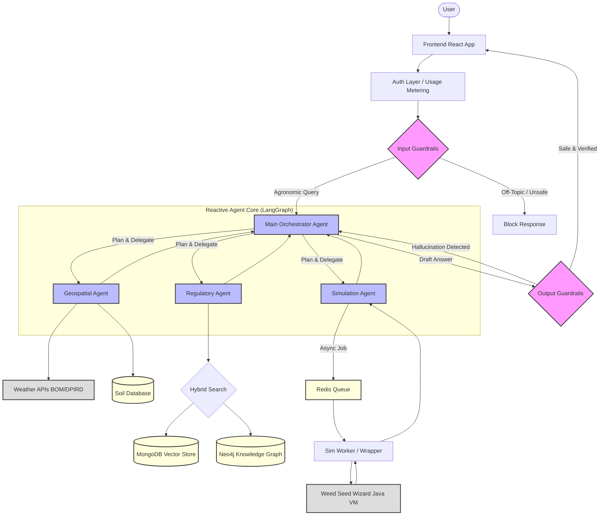

**Guardrail pattern**:

1.  **Input Rail:** Filters user queries *before* they reach the agents (e.g., blocking political or medical questions).
2.  **Output Rail:** Validates the agent's response *before* sending it to the user (ensuring the response stays within the agronomic domain).

Here is the detailed development roadmap and the architectural diagram.

-----

### **Development Roadmap**

#### **Phase 1: Domain-Specific Guardrails & Governance**

*Objective: Define the "Safety Box" for the AI. If the query isn't about crops, weeds, or herbicides, the system refuses to answer.*

  * **Sub-Tasks:**
      * Define **Topical Rails** (Allowed topics: Agronomy, Botany, Weed Identification, Chemistry, Weather. Disallowed: Human Medicine, Politics, General Coding, other tasks of agriculture that not related to weed management).
      * Implement **Jailbreak Detection** (Preventing users from bypassing safety prompts).
      * Develop **Hallucination Detection** (Check if cited herbicide rates actually exist in the retrieved context).
      * Set up PII (Personally Identifiable Information) masking if user farm data is uploaded.
  * **Libraries needed:** `nemo-guardrails` (NVIDIA), `guardrails-ai`, or `llama-guard` (Meta).
  * **Resources needed:** A dedicated small LLM (e.g., a fine-tuned Llama-3-8b) specifically for classification tasks to keep latency low.

#### **Phase 2: Advanced Data Ingestion & Non-Naive Graph RAG**

*Objective: Build the base knowledge layer from APVMA documents.*

  * **Sub-Tasks:**
      * ✅ Herbicide PDF labels are available under data/labels folder (386 PDFs).
      * ✅ Implement **Multi-Modal Parsing** to convert PDF Tables into Markdown using **PyMuPDF4LLM** (local, offline).
        - All 386 labels parsed successfully
        - Tables preserved (Directions for Use, Weed Tables, Plant-back periods)
        - YAML frontmatter with metadata extraction
      * ✅ **Document Cleaning:** `cleaner.py` removes noise (headers, safety directions, disposal info).
        - 388 files processed, 12.3% size reduction
      * ✅ **Structured Extraction:** `extractor.py` uses Gemini API for schema-based extraction.
        - Pydantic models: `HerbicideLabel`, `WeedControlEntry`
        - Extracts crops, weeds, rates, timing, states, control levels
        - 22/386 files extracted (free tier limit: 20 req/day per model)
      * Set up **MongoDB Atlas** for vector storage. Check whether to use Pinecone, ChromaDB or Weaviate as an alternative.
      * Implement **Contextual Chunking** (Prepend product name/active ingredient to every text chunk).
  * **Libraries needed:** ~~`llama-parse`~~ `pymupdf4llm` (for PDF tables), `google-genai` (Gemini extraction), `pydantic`, `neo4j`.
  * **Resources needed:** ~~LlamaCloud API Key~~ Gemini API Key, Neo4j AuraDB Instance.

#### **Phase 3: The Knowledge Graph (GraphRAG)**

*Objective: Map the relationships between Weeds, Crops, and Chemicals to enable complex reasoning.*

  * **Sub-Tasks:**
      * ✅ Design the Ontology (Schema): `(Herbicide)-[:CONTROLS]->(Weed)`, `(Herbicide)-[:REGISTERED_FOR]->(Crop)`.
        - Additional: `(Herbicide)-[:CONTAINS]->(ActiveConstituent)`, `(Herbicide)-[:HAS_MODE_OF_ACTION]->(ModeOfAction)`, `(Herbicide)-[:REGISTERED_IN]->(State)`
      * ✅ Built `packages/graph` package with:
        - `schema.py`: Constraints, indexes, reference data (8 States, 19 MOA groups)
        - `loader.py`: JSON → Neo4j loader with normalization
        - `queries.py`: Query functions (`find_herbicides_for_weed`, `get_moa_rotation_options`, etc.)
      * ✅ **Current Graph Stats (partial load):**
        - 21 Herbicides, 91 Crops, 290 Weeds
        - 537 CONTROLS relationships
        - Top weeds: capeweed (7), annual ryegrass (6), wild radish (5)
      * 🔄 Complete extraction and load remaining ~365 herbicides
      * Connect the RAG system to the Graph (GraphRAG) so the agent can query structure *and* text.
  * **Libraries needed:** `neo4j` (Python driver), `google-genai`, `pydantic`, `python-dotenv`.
  * **Resources needed:** ✅ Neo4j AuraDB (Cloud) - Connected and operational.

#### **Phase 4: Simulation Wrapper (The "Sidecar")**

*Objective: Make the legacy "Weed Seed Wizard" accessible via API.*

  * **Sub-Tasks:**
      * Containerize the Weed Seed Wizard (Java/Eclipse RCP) in Docker with a headless JRE.
      * Build a **FastAPI** wrapper to accept JSON, write the simulation files, run the Java CLI, and parse the output CSV.
      * Implement an asynchronous task queue (The simulation takes time; the HTTP request shouldn't hang).
  * **Libraries needed:** `fastapi`, `celery` (or `rq`), `redis` (as message broker), `pandas` (to parse simulation outputs).
  * **Resources needed:** GCP Compute Engine or Cloud Run (requires ample RAM for Java).

#### **Phase 5: Agent Orchestration (The "Brain")**

*Objective: The LangGraph controller that routes tasks to the tools above. Discuss this with technical herbicide management team*

  * **Sub-Tasks:**
      * Build the **State Graph**: Define nodes (Supervisor, Researcher, Simulator, Coder) and edges.
      * Implement **Tool Definitions**: Standardize inputs for the Geo-agent, Reg-agent, and Sim-agent.
      * Integrate the **Guardrails** from Phase 1 into the entry/exit points of the graph.
  * **Libraries needed:** `langgraph`, `langchain`, `pydantic` (for strict data validation).
  * **Resources needed:** OpenAI API (GPT-4o) or Vertex AI (Gemini 1.5 Pro) for the Orchestrator.

#### **Phase 6: Deployment & Frontend**

*Objective: User interface and infrastructure.*

##### Questions:
Where will the graphRag be hosted? How will the frontend communicate with the backend?

  * **Sub-Tasks:**
      * Develop React/Next.js frontend with chat interface and map visualization.
      * Implement **Auth0** or **Firebase Auth**.
      * Set up API Gateway and Usage Tracking (for future billing).
  * **Libraries needed:** `React`, `TailwindCSS`, `Leaflet` (for maps).
  * **Resources needed:** Vercel (Frontend), GCP Cloud Run (Backend).

-----

### **System Architecture Diagram**

This diagram illustrates the flow from the User, through the Guardrails, to the Orchestrator, and out to the asynchronous agents.

 
## Points to consider (Agent to not delete):
v0.1 - GA 11/12/25
* Embeddings models can be fine-tuned for agronomic jargon to improve retrieval accuracy. This can rely on publically available transcripts of youtube videos from experts in the field, podcasts, technical publications etc. This can provide the Reinforcement Learning with Expert Feedback (RLEF) needed to improve model performance in niche domains, generating a dataset of Q&A pairs specific to weed management.
* A better embedding would reduce hallucinations but also improve entry points for the graph RAG system, allowing more complex queries to be answered accurately.
* When generating the knowledge graph, consider leveraging existing ontologies in the agricultural domain to ensure interoperability and standardization. The parsing of documents will require data clean up.
* Focus should be given to asynchronous agents . Check the use of smolagent alongside langchain.
* Need to consider the pipeline evaulation, Ragas for rag evaluation. 
* Need to discuss on the front-end information for UX and UI design with stakeholders.
